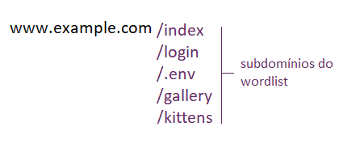
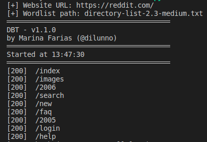

## [PT-BR] - Directory brute force 

### Força bruta em cibersegurança

Um ataque de força bruta busca violar senhas, nome de usuários, URLs e chaves para criptografia inserindo automaticamente valores nos campos em questão. Imagine que você queira acessar a sua antiga conta com o e-mail _johndoe@gmail.com. Com um brute-force de senhas, o programa automaticamente inseriria o seu e-mail e tentaria usar uma lista de senhas diferentes até que a senha correta seja inserida (essa lista de senhas é o que chamamos de wordlist).

### Directory brute force

O directory brute force funciona de uma maneira semelhante, porém ao invés de tentar adivinhar a senha de uma conta, tentamos adivinhar subdomínios de websites.

Imagine que você queira encontrar subdomínios no site www.example.com. Talvez esse site possua subdomínios de log-in de administrador, senhas de bancos de dados, informações sensíveis de seus consumidores, etc. Neste exemplo, você infomaria ao programa o domínio em que você quer descobrir os subdomínios (www.example.com) e uma wordlist (um arquivo .txt contendo diversas strings, nesse caso, subdomínios) será inserida ao final. Veja o exemplo a seguir:

### Como utilizar

Primeiramente, você terá que informar o domínio base em que você deseja encontrar os subdomínios (website URL).   
Depois, você deverá informar a wordlist (wordlist path).

Lembrando que existem wordlists de diversos tipos. Como estamos lidando com um brute-force de diretórios, precisamos de uma wordlist que contenha subdomínios. Você pode encontrar elas [no próprio Github.](https://github.com/kkrypt0nn/Wordlists)

